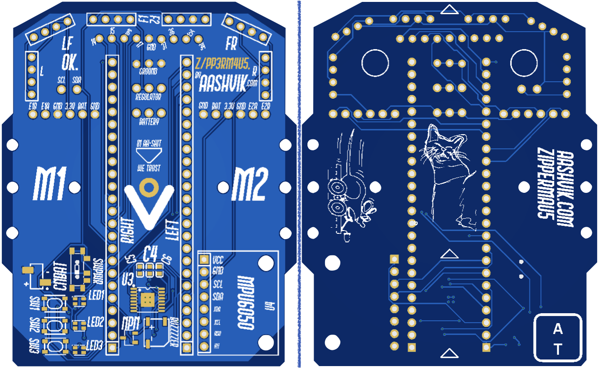

_ZIPPERMAU5_ is my WIP micromouse robot!

This repository contains zippermau5's platformio project files and the zippermau5 website's source.

The current status of the project is that some basic mazesolving is working, the pcb is here and assembled, and I'm going to be working on getting the mouse to run!

Here's a small list of this micromouse's features:
- a floodfill mazesolving algorithm, inspired by peter harrison's open/closed maze tactic
- vl53 tOf sensors for maze sensing, with an mpu6050 imu for dead-reckoning
- teensy 4.1, programmed in cpp using the platformio framework
- a custom pcb, designed in easyeda, and manufactured by jlcpcb, with assembly for small smd parts from lcsc electionics
- dual 1200rpm "n20" motors w/magnetic hall encoders
- drv8833 motor driver ic, but I FORGOT TO BREAK OUT THE MOTOR PINS AAAAAGH
- a buzzer, 3 pushbuttons and 3 rgb leds for debugging/interaction
- a 25c 3.7v 850mAh lipo

Oh, and if anyone wants them, some bits of old and unused code can be found here: https://github.com/AashvikTyagi/slowmau5
